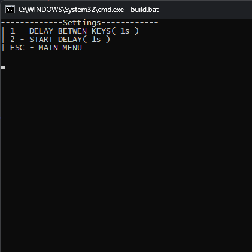
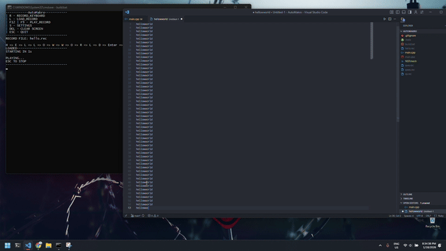

# AutoMakro (Windows)

**AutoMakro** is a lightweight Windows console application that records and replays keyboard macros using the Win32 `SendInput` API.  

---

## Features
- Record keyboard input
- Save and load macros (`.rec` files)
- Replay macros globally (no focus required)
- Adjustable delay between key presses
- Simple console-based UI
- Multi-threaded input polling and playback

---

## Controls
- **R** – Start recording
- **ESC** – Stop recording / Stop playback / Quit
- **L** – Load a macro file
- **F12 | F9** – Play loaded macro (no focus required)
- **S** – Open settings

---

## Settings
- **Delay between keys** (in seconds, minimum `0.005s`)
- **Delay start** (in seconds, minimum `0s`)
---

## File Format
- Binary `.rec` file
- Stores:
  - Number of recorded keys
  - Virtual key codes in the order they were pressed

---

## Build
- **Platform:** Windows
- **Language:** C++
- **API:** Win32 (`SendInput`, `GetAsyncKeyState`)
- **Compiler:** MSVC or MinGW (C++17+)

---

## Notes
- The console input buffer is flushed before `std::cin` to prevent stuck or injected keys from appearing in input
- Playback uses scancodes for better key compatibility
- Some applications or games may block injected input (anti-cheat systems)
